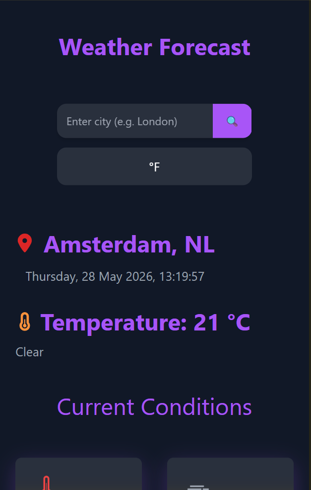
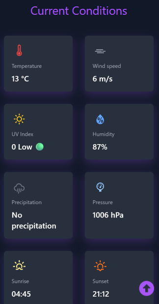
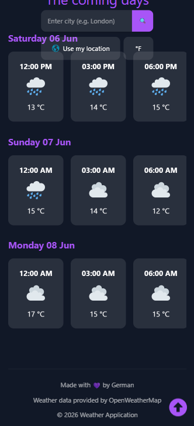
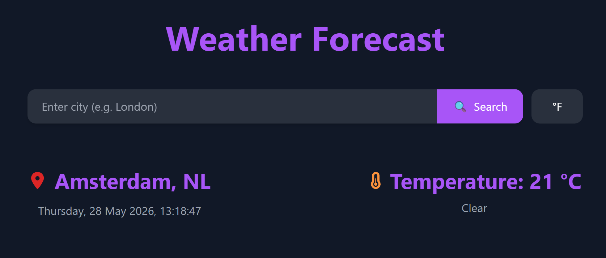
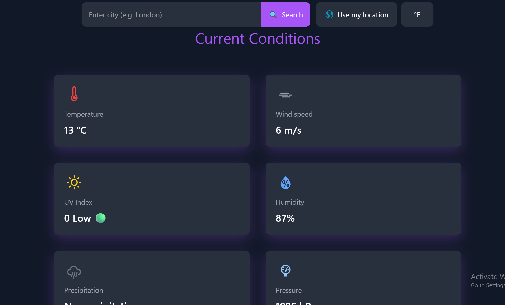
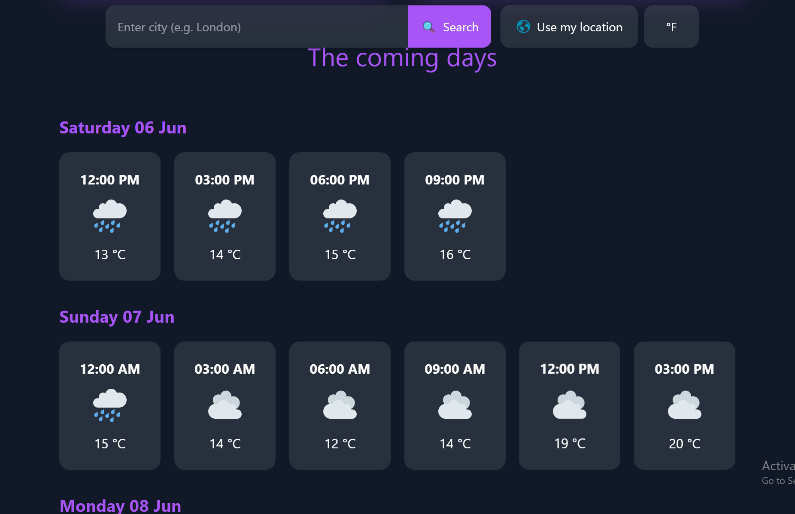
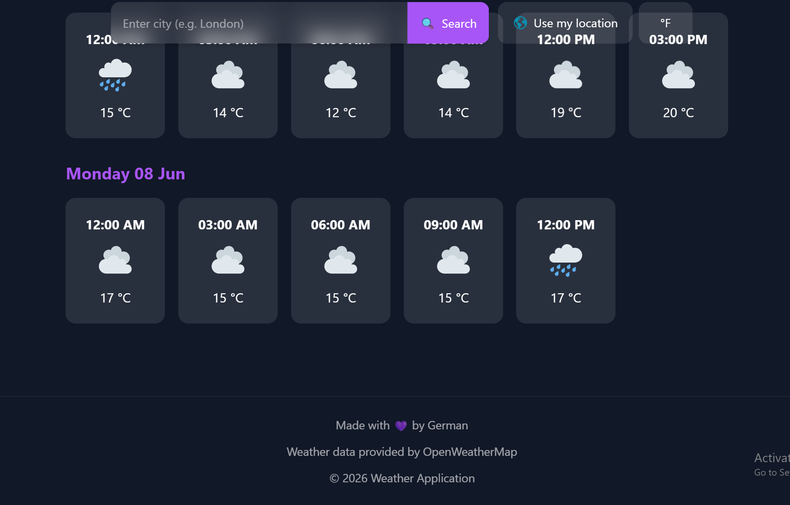

# 🌦️ Weather App

A modern weather application built with React + Vite featuring a clean UI, smooth animations, and real-time weather data.

## ✨ Features

- 🔍 Search weather by city
- 🌡️ Real-time temperature data
- 🔁 Switching between Celsius and Fahrenheit
- ☁️ Current weather conditions
- 💨 Wind speed information
- 💧 Humidity tracking
- 🎨 Modern and responsive UI
- ⚡ Smooth animations
- 📱 Mobile-friendly design
- 🚀 Fast performance powered by Vite
- 🌐 Use current location to fetch real-time weather data

## 🛠️ Tech Stack

- ⚛️ React
- ⚡ Vite
- 🎞️ Framer Motion
- 🎨 CSS / Tailwind CSS
- 🌍 Weather API
- 🔗 GitHub + Vercel

## 📸 Preview

/assets/preview/

Mobile version:

PC version:

## 🚀 Live Demo

🌐 Deployment:

https://weather-application-omega-flax.vercel.app/

## 📦 Installation

Clone the repository:

git clone https://github.com/German900-code/Weather-Application

Navigate to the project folder:

cd weather-app

Install dependencies:

npm install

Start the development server:

npm run dev

## 🔑 Environment Variables

Create a `.env` file:

VITE_API_KEY=your_api_key

## 🏗️ Build

npm run build

## ☁️ Deployment

This project can be easily deployed using:

- Vercel
- Netlify
- GitHub Pages

## 📂 Project Structure

src/
├── assets/
├── components/
├── utils/
├── App.jsx
└── main.jsx

## 🎯 Future Improvements

- 📅 Weather forecast
- 🌙 Dark mode
- 🧊 Enhanced animations
- 🔔 Notifications

## 👨‍💻 Author

Made with ❤️ by German Voloshyn

## ⭐ Support

If you like this project, consider giving it a ⭐ on GitHub 😄
